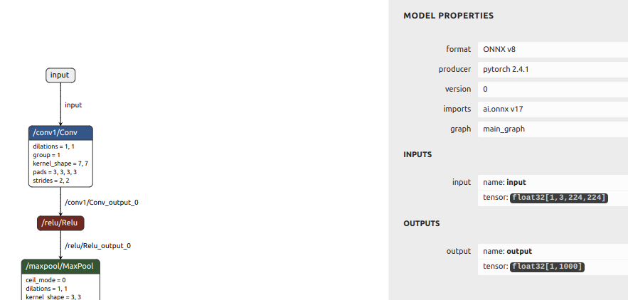

# Running ModelSDK on an ONNX ResNet50 classifier model #

How to quantize and compile a ResNet50 ONNX classifier model using Palette 1.6. 

This tutorial shows how to run default Post-Training Quantization (PTQ), evaluate the quantized model and then compiling for the output .tar.gz archive.


## Before starting ##

### The ONNX model ###

Unzip the ONNX model:

```shell
unzip ./onnx/resnet50.zip -d ./onnx
```

The ONNX model is trained on the ImageNet dataset using images that have been scaled up to 224(W)x224(H).

The ONNX model must:

* Be completely floating-point 32bit
* Have static input dimensions
* Have a batch dimension of None or 1 (the implemented batch size can be set during the compile phase)


To check this, use the [Netron](https://netron.app/) tool:





We see in Netron that the input (called 'input') has a shape of 1,3,224,224.


Note down the name of the input and its shape - you will need it later. It also useful to know the order of the model input dimensions - in this case, the order is NCHW (N=batch, C=channels, H=Height, W=Width)


### Pre and post-processing ###

You must know what pre- and post-processing was applied during the training of the floating-point model. For this model the pre-processing was division by 255 to bring all pixels into the range 0 to 1, followed by means subtraction using [0.485, 0.456, 0.406] and division by the standard deviation values of [0.229, 0.224, 0.225].

The post-processing is just simply an argmax function to find the class with the highest probability.


### Calibration data ###

We need a small number of samples from the training dataset to use during the quantization process. These should be randomly chosed from the training dataset.
For this tutorial, the calibration samples are not supplied as image files but are instead wrapped into a single numpy file (calib_data.npz) as numpy arrays.

Unpacking the calibration data numpy file is straightforward - it contains a single array called 'x':

```python
with np.load(args.calib_data) as data:
    calib_images = data['x']
    print('Number of calibration images: ', calib_images.shape[0])
```


### Test data and labels ###

If we want to test the results of quantization and compare it to the original floating-point model (highly recommended!) then we will need some test data and ground truth labels. Like the calibration data, these are also packed into a single numpy file (test_data.npz) which contains 2 arrays: 'x' is the test data and 'y' are the integer labels corresponding to the 1000 ImageNet classes.


```python
with np.load(args.test_data) as data:
    test_images = data['x']
    labels = data['y']
    print('Number of test images: ', test_images.shape[0])
```

> *Note: There are only 50 samples and labels in the test_data.npz numpy file to simplify this tutorial which will impact accuracy results - the complete ImageNet validation dataset of 50k images should actually be used.*


## Test the floating-point ONNX model ##

An optional step is to run inference of the original ONNX model and check the output to ensure that it is functional and to create a baseline reference. ONNX and the ONNX Runtime are included in the SDK docker, so we can run the floating-point model. The run_onnx.py script includes pre- and postprocessing. 

Start the Palette docker container - just reply with './' when asked for the work directory:

```shell
./start.py
```

The output in the console will look like this:

```shell
user@ubmsh:~/tutorials/modelsdk_onnx$ ./start.py 
Set no_proxy to localhost,127.0.0.0
Using port 49152 for the installation.
Checking if the container is already running...
Enter work directory [/home/user/tutorials/modelsdk_onnx]: ./
Starting the container: palettesdk_1_6_0_Palette_SDK_master_B163
Checking SiMa SDK Bridge Network...
SiMa SDK Bridge Network found.
Creating and starting the Docker container...
b376b867257233623491103715372c56d56d0403ca3c0da4d68a3cde2c7c6a27
Successfully copied 3.07kB to /home/user/tutorials/modelsdk_onnx/passwd.txt
Successfully copied 3.07kB to palettesdk_1_6_0_Palette_SDK_master_B163:/etc/passwd
Successfully copied 2.56kB to /home/user/tutorials/modelsdk_onnx/shadow.txt
Successfully copied 2.56kB to palettesdk_1_6_0_Palette_SDK_master_B163:/etc/shadow
Successfully copied 2.56kB to /home/user/tutorials/modelsdk_onnx/group.txt
Successfully copied 2.56kB to palettesdk_1_6_0_Palette_SDK_master_B163:/etc/group
Successfully copied 3.58kB to /home/user/tutorials/modelsdk_onnx/sudoers.txt
Successfully copied 3.58kB to palettesdk_1_6_0_Palette_SDK_master_B163:/etc/sudoers
Successfully copied 2.05kB to palettesdk_1_6_0_Palette_SDK_master_B163:/home/docker/.simaai/.port
user@b376b8672572:/home$ 
```

Then navigate into the working directory:

```shell
user@b376b8672572:/home$ cd docker/sima-cli
```

Now execute the script that runs the floating-point Keras model: 

```shell
user@b376b8672572:/home/docker/sima-cli$ python run_onnx.py
```


The output predictions are listed and a final accuracy scores is given:

```shell
--------------------------------------------------
3.10.12 (main, Mar 31 2025, 18:12:36) [GCC 11.4.0]
--------------------------------------------------
Loaded model from ./onnx/resnet50.onnx
Model inputs:
 input  (1, 3, 224, 224)
Number of test images:  50
Correct predictions:  30  Accuracy %: 60.0
```


## Quantize & Compile ##

The run_modelsdk.py script will do the following:

* Interrogate the ONNX model to get input names & shapes.
* load the floating-point ONNX model.
* quantize using pre-processed calibration data and default quantization parameters.
* test the quantized model accuracy using pre-processed images. An accuracy value is generated and should be compared to the value obtained from the floating-point model.
* compile to generate a tar.gz

```shell
python run_modelsdk.py
```

If this runs correctly, the final output messages in the console will be like this:

```shell
2025-04-27 03:20:02,501 - afe.backends.mpk.interface - INFO - ==============================
2025-04-27 03:20:02,501 - afe.backends.mpk.interface - INFO - Compilation summary:
2025-04-27 03:20:02,501 - afe.backends.mpk.interface - INFO - ------------------------------
2025-04-27 03:20:02,502 - afe.backends.mpk.interface - INFO - Desired batch size: 1
2025-04-27 03:20:02,502 - afe.backends.mpk.interface - INFO - Achieved batch size: 1
2025-04-27 03:20:02,502 - afe.backends.mpk.interface - INFO - ------------------------------
2025-04-27 03:20:02,502 - afe.backends.mpk.interface - INFO - Plugin distribution per backend:
2025-04-27 03:20:02,502 - afe.backends.mpk.interface - INFO -   MLA : 1
2025-04-27 03:20:02,502 - afe.backends.mpk.interface - INFO -   EV74: 5
2025-04-27 03:20:02,502 - afe.backends.mpk.interface - INFO -   A65 : 0
2025-04-27 03:20:02,502 - afe.backends.mpk.interface - INFO - ------------------------------
2025-04-27 03:20:02,502 - afe.backends.mpk.interface - INFO - Generated files: resnet50_mpk.json, mla.json, resnet50_stage1_mla_stats.yaml, preproc.json, resnet50_stage1_mla.elf, detess_dequant.json
Compiled model written to build/resnet50
```

The compiled model is written to build/resnet50/resnet50_mpk.tar.gz.


### Code Walkthrough ###

The ONNX model is loaded and interrogated to return a list of input names and shapes. The input names and their shapes are needed as parameters when we load the model into the SiMa 'LoadedNet' format. First we the input shapes dictionary. Each key, value pair in the input shapes dictionary is an input name (string) and an 4-dimensional shape (tuple).

```python
model = onnx.load(args.model_path)
input_names_list=[node.name for node in model.graph.input]
input_shapes_list = [tuple(d.dim_value for d in _input.type.tensor_type.shape.dim) for _input in model.graph.input]
print('Model inputs:')
for n,s in zip(input_names_list,input_shapes_list):
    print(f' {n}  {s}')
```

The input names and their shapes are needed as parameters when we load the model into the SiMa 'LoadedNet' format. First we the input shapes dictionary. Each key, value pair in the input shapes dictionary is an input name (string) and an 4-dimensional shape (tuple).


We then set up the importer parameters and load the floating-point ONNX model:

```python
importer_params: ImporterParams = onnx_source(model_path=args.model_path,
                                              shape_dict=input_shapes_dict,
                                              dtype_dict=input_types_dict)

# load ONNX floating-point model into SiMa's LoadedNet format
loaded_net = load_model(importer_params)
print(f'Loaded model from {args.model_path}')
```

The calibration images are read from the calib_data.npz numpy file and then preprocessed before being appended to an iterable variable (a list in the case). Each calibration sample is provided as a dictionary, the key is the name of the input that will have the preprocessed calibration sample applied to it, the value is the preprocessed sample:


```python
with np.load(args.calib_data) as data:
    calib_images = data['x']
    print('Number of calibration images: ', calib_images.shape[0])

# make a list of preprocessed calibration images
calibration_data=[]
for img in (calib_images):
    preproc_image = _preprocessing(img)
    calibration_data.append({input_names_list[0]:preproc_image})
```

> *It is very important that the same preprocessing used during training of the model is also applied to the calibration data*


The LoadedNet model is then quantized using default quantization parameters. We can also optionally save the quantized model which will allow us to open it with Netron if required:

```python
quant_model = loaded_net.quantize(calibration_data=length_hinted(len(calib_images),calibration_data),
                                  quantization_config=default_quantization,
                                  model_name=filename,
                                  log_level=logging.WARN)

quant_model.save(model_name=filename, output_directory=output_path)
print (f'Quantized and saved to {output_path}')
```


An optional, but highly recommended, step is to evaluate the quantized model to assess the impact of quantization:


```python
# unpack test images and labels
with np.load(args.test_data) as data:
    test_images = data['x']
    labels = data['y']
    print('Number of test images: ', test_images.shape[0])

correct=0
for i,img in enumerate(test_images):
    
    # preprocess
    img = _preprocessing(img)
    # dictionary key is name of input that preprocessed sample will be applied to
    test_data={input_names_list[0]: img }
    # emulate the quantized model
    prediction = quant_model.execute(test_data, fast_mode=True)
    # post-processing - argmax reduction
    prediction = np.argmax(prediction)
    if prediction == labels[i]:
        correct += 1

accuracy = correct / len(labels) * 100
print('Correct predictions: ', correct, ' Accuracy %:', accuracy)
```

Then finally we compile the quantized model:


```python
quant_model.compile(output_path=output_path,
                    batch_size=args.batch_size,
                    log_level=logging.INFO)  
```

This creates a .tar.gz archive that contains the .elf file that will be executed on the Machine Learning Accelerator (MLA).

## Next Steps ##

Once our model is quantized, evaluated and compiled into a .tar.gz archive, it can now be incorporated into a full pipeline.

* Import the compiled model into the Edgematic tool and build the pipeline using graphical design entry.
* Run the 'mpk project create' command to build a small Gstreamer pipeline as a starting point 

```shell
user@b376b8672572:/home/docker/sima-cli$ mpk project create --model-path ./build/resnet50/resnet50_mpk.tar.gz --input-resource ./test_data/img_%d.png
```


